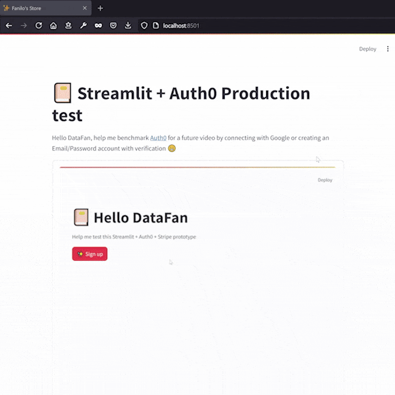

# Streamlit Auth0 Test



## Prerequisites

- A Google Project. Initialize one from the [GCP Console](https://console.cloud.google.com/)
- An [Auth0](https://auth0.com/) Account

## Google OAuth2 configuration

Follow the Google Identity OpenID Connect [tutorial](https://developers.google.com/identity/openid-connect/openid-connect#appsetup) to set up OAuth 2.0

After following it, you should have:

- an OAuth 2 client on the [Clients Page](https://console.developers.google.com/auth/clients)
  - configured with an `Authorised redirect URI` set to `http://localhost:8501/oauth2callback`
- your user consent screen configured on the [Branding Page](https://console.developers.google.com/auth/branding) for App name and User support email
- `openid`, `.../auth/userinfo.email` and `.../auth/userinfo.profile` as enabled scopes in the [Data Access Page](https://console.cloud.google.com/auth/scopes)

On the Streamlit side, create `.streamlit/secrets.toml` in local development, or from the `Secrets` tab in `App Settings`, with the following content:

- Copy the credentials `client_id` and `client_secret` from your created OAuth2 Client

```toml
[auth]
redirect_uri="http://localhost:8501/oauth2callback"
cookie_secret=<generate a long random string>

[auth.google]
client_id="XXX.apps.googleusercontent.com"
client_secret="XXXXXX-..."
server_metadata_url="https://accounts.google.com/.well-known/openid-configuration"
```

Use `st.login("google")` part in `app/landing.py` to enable Google Authentication from your Streamlit app.

## Auth0 configuration

- Create a new tenant for your app. It should come with preconfigured components for you, you're free to recreate each of them though:
  - In `Authentication > Database`, a default email/password database for users who don't sign up with Google
  - In `Authentication > Social`, a `google-oauth2` connection.
    - You need to fill the `Client ID` and `Client Secret` fields with values from your Google Client page
    - You can find the documentation to create the Google `Client ID` and `Client Secret` on the [Auth0 Marketplace](https://marketplace.auth0.com/integrations/google-social-connection). Most Social Connections are documented in the same way.
  - In `Applications > Applications`, a Default Regular Web Application.
    - Verify it is linked to the database and google-oauth connections in the `Connections` tab of the application.
    - If deploying, you need to add `https://HOST/oauth2callback` as `Allowed Callback URLs` and `https://HOST` as `Allowed Logout URLs

Copy the `Client ID` and `Client Secret` from the default application Settings, back into your Secrets:

```toml
[auth]
redirect_uri="http://localhost:8501/oauth2callback"
cookie_secret=<generate a long random string>

[auth.auth0]
client_id = "XXX"
client_secret = "XXX"
server_metadata_url="https://<DOMAIN>.<REGION>.auth0.com/.well-known/openid-configuration"
client_kwargs = { "prompt" = "login" }
```

As documented on the Google Social login [doc](https://marketplace.auth0.com/integrations/google-social-connection), you also need to authorize Auth0 callbacks back into your Google OAuth2 Web Application Client:

- Add your Auth0 domain `https://<DOMAIN>.<REGION>.auth0.com` to `Authorised JavaScript origins`
- Add `https://<DOMAIN>.<REGION>.auth0.com/login/callback` to `Authorized redirect URIs`

Use `st.login("auth0")` in `app/landing.py` to enable Google and Email/Password Authentication with Auth0 from your Streamlit app.
